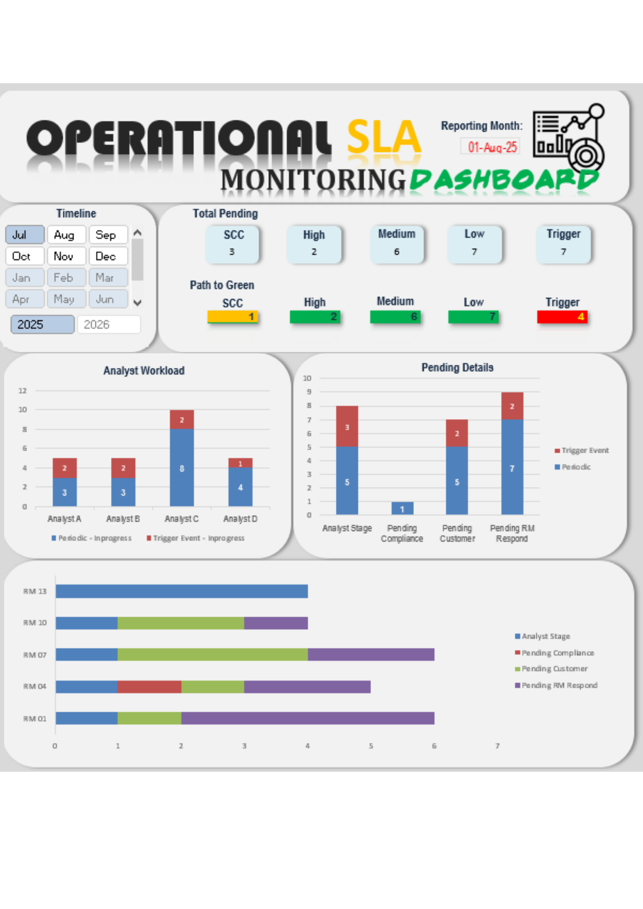

# Operational SLA Monitoring Dashboard

## 📌 Project Overview

This project demonstrates how operational data can be transformed into an interactive dashboard to support Service Level Agreement (SLA) monitoring within an operations team.

The dashboard helps Team Leaders monitor ongoing customer review cases, identify overdue workloads, and prioritize actions required to maintain operational KPI performance determined by Management.

The business scenario is inspired by real operational processes in banking. All data used in this project is dummy data created for portfolio purposes.

> **Note:** This project uses a dummy dataset inspired by real operational experience. No confidential or company data is included.

---

## ❗ Business Problem

Managing hundreds of ongoing customer review cases across multiple analysts is challenging.

Without centralized monitoring, operations teams may experience:

- Increasing overdue cases
- Imbalance analyst workload
- Limited visibility of pending cases
- Difficulty achieving monthly KPI target
- Delayed operational decision making

This dashboard was developed to provide a centralized operational monitoring solution that supports faster and better decision making.

---

## 💼 Business Objective

The dashboard is designed to help operational stakeholders answer the following business questions:

- How many cases are currently pending?
- Which cases are overdue?
- Are we still on track to achieve the monthly SLA target?
- How many additional cases need to be completed to reach Green KPI?
- Which analyst currently has the highest workload?
- Where are pending cases currently stuck?
- Which Relationship Managers require immediate follow-up?

The primary objective is to improve operational visibility and support faster, data-driven decision making.

---

## 🎯 Project Objective

Build an interactive dashboard that enables stakeholders to:

- Monitor operational progress
- Track SLA performance
- Identify overdue cases
- Monitor upcoming due cases
- Support workload prioritization
- Improve operational visibility

---

## 📊 Dashboard Features

### Total Pending

Displays the number of ongoing customer review cases grouped by Risk Rating (SCC, High, Medium, Low, and Trigger Event). 
*Note: This group was detemined by management which could be different based on requirement.*

**Business Purpose**

- Monitor current operational workload
- Identify areas requiring immediate attention

--

### Path to Green

Shows the minimum number of additional cases that must be completed to achieve the Green KPI threshold.

**Business Purpose**

- Track progress toward monthly SLA target & manage prioritization
- Support daily and weekly operational planning

--

### Analyst Workload

Displays the number of ongoing cases assigned to each analyst.

**Business Purpose**

- Balance workloads across analysts
- Prevent resource overload

--

### Pending Details

Displays the current status of pending cases.

Examples include:

- Analyst Stage
- Pending RM Response
- Pending Customer
- Pending Compliance

**Business Purpose**

- Identify operational bottlenecks
- Support escalation decisions

--

### Pending by Relationship Manager

Displays pending cases grouped by Relationship Manager.

**Business Purpose**

- Help Team Leaders prioritize follow-up
- Improve communication between Operations and Business teams

--

### 📋 Data Dictionary

| Column | Data Type | Description |
|---------|-----------|-------------|
| customer_number | Text | Complete unique customer identifier |
| CIF | Text | Unique customer identifier used in the core banking system |
| customer_name | Text | Customer name |
| risk_rating | Text | Customer risk classification (SCC, High, Medium, Low) |
| review_reason | Text | Reason for the review (Periodic or Trigger Event) |
| initiated_date | Date | Date when the KYC review was initiated |
| due_date | Date | SLA due date for completing the review |
| month_due_date | Text | Month extracted from the Due Date |
| year_due_date | Number | Year extracted from the Due Date |
| latest_status | Text | Current workflow status |
| completed_date | Date | Date when the review was completed |
| aging | Number | Number of days since the review was initiated |
| aging_category | Text | 0–60 days, 61–90 days, 91–180 days, >180 days |
| letter_date | Date | Date when the reminder letter should be sent |
| restriction_date | Date | Date when customer services may be restricted due to incomplete documentation |
| relationship_manager | Text | Name of Relationship Manager |
| rm_team_leader | Text | Team Leader responsible for the Relationship Manager |
| analyst | Text | Assigned KYC Analyst responsible for the review |
| additional_remarks | Text | Additional notes regarding pending issues or operational remarks |

--

### 📐 Business Rules

| Rule | Definition |
|------|------------|
| Aging | Reporting Date − Initiated Date |
| Overdue | Aging with >90 days (category 91-180 days and >180 days) |
| Green KPI | Number of profile overdue <= 5% |
| Amber KPI | Number of profile overdue 5% < and <= 10% |
| Red KPI | Number of profile overdue >10% |
| Path to Green | Number of cases that must be completed to achieve the Green KPI threshold |

---

## 🛠 Tools & Skills

### Tools

- Microsoft Excel
- Pivot Table
- Pivot Chart
- Slicer
- Conditional Formatting

### Excel Functions

- IF
- EOMONTH
- MID
- RIGHT
- VLOOKUP

### Skills Demonstrated

- Operational Reporting
- SLA Monitoring
- Dashboard Design
- KPI Tracking
- Data Cleaning
- Business Analysis
- Data Visualization

---

# 📈 Business Insights

### Insight 1 – Trigger Event requires immediate attention

**Observation**

Trigger Event remains in **Red** status with **7 overdue cases** at the end of July 2025.

**Business Impact**

The monthly SLA target for Trigger Event reviews has not yet been achieved, increasing operational and compliance risk.

**Possible Cause**

Most overdue Trigger Event cases are currently pending at the Analyst Review and RM Response stages.

---

### Insight 2 – Periodic reviews are generally under control

**Observation**

Periodic reviews across most risk ratings have achieved the Green KPI threshold, except for SCC.

**Business Impact**

Routine operational reviews are progressing as expected, allowing the team to focus on higher-risk outstanding cases.

---

### Insight 3 – Analyst workload should be reviewed

**Observation**

Analyst C currently has the highest number of ongoing cases.

**Possible Cause**

Further investigation is required to determine whether this is caused by workload imbalance, case complexity, or delayed customer response.

---

### Insight 4 – RM follow-up is a priority

**Observation**

Pending RM Response represents one of the largest groups of outstanding cases.

**Business Impact**

Faster follow-up with Relationship Managers could significantly reduce overdue cases and improve SLA performance.

---

# 💡 Business Recommendations

Based on the analysis above, the following actions are recommended:

1. Conduct daily follow-up with Relationship Managers for pending responses.
2. Review Analyst C's workload and redistribute cases if necessary.
3. Investigate the root cause of delays in Analyst Review and RM Response stages.
4. Monitor the Path to Green KPI during weekly operational meetings.

---
